# 显影台 · 产品说明

犀牛鸟 2026 · Task 02。用 Task 01 的色阶当滤镜的风光摄影调色台，面向电脑端浏览器（Chrome / Edge）。

| | |
|---|---|
| 在线演示 | https://liamfan16-mikasa.github.io/Tdesign-LiamFan/task02-develop/dist/ |
| 源码仓库 | https://github.com/LiamFan16-mikasa/Tdesign-LiamFan |
| 运行方式 | 见仓库根目录 [README](README.md) 的「本地运行」 |

---

## 一、产品动机

**滤镜是黑盒。** 修图软件里的滤镜只有一个名字和一个强度滑块：它把暗部推成什么颜色、高光留到多亮，用户看不见也改不了，调出满意的效果也很难带到下一张照片上。

**任务一做出了一条「看得见」的色阶。** 输入一个主色，得到十阶由浅到深、明度过渡均匀的颜色。这条色阶天然就能当滤镜用：照片的暗部取深端，高光取浅端，中间按明度逐阶映射（渐变映射）。

**所以显影台把两件事合成一件：** 给照片调色的那条色阶，同时就是界面的主题色。选一个色调，照片被重新上色，界面里的 TDesign 组件（按钮、滑块、选中态）也同时换成这条色阶；调好的色调可以直接导出成一套 TDesign Design Token。滤镜不再是黑盒，而是一条能看见、能改、能导出的十阶色阶。

**任务要求怎么落地：**

- 使用任务一的色阶生成能力：直接引用 `task01-palette/src` 的源码，不复制一份。
- 主题色切换：从照片提取四条候选色调（原色、偏暖、偏冷、互补），也可以自定义任意主色；每次切换都重新生成色阶。
- 替换 TDesign 色彩 token：生成的 10 阶品牌色与 14 阶中性色写成 24 个 CSS 变量覆盖到 `:root`。TDesign 的语义 token（如 `--td-brand-color`）本身引用这些数字 token，所以组件整体跟着切换。
- 切换后风格保持一致：界面外壳是不随色阶变化的中性深色，色阶只出现在需要强调的地方；深色面板里再局部换一套文字、底色、描边 token，保证任何色调下都清楚可读。

## 二、设计理念

**暗房里的灯箱。** 摄影师挑片是把照片摊在灯箱上看。显影台的调色台就是一块深色灯箱台面：照片放在正中，是全场唯一的主角；工具退到右侧的深色玻璃面板里。

**背景就是正在调的这张照片。** 没放照片时，整页背景轮播示例照片，模糊成一片流动的色彩氛围。放上照片后，调色画布每渲染一次，背景就同步一次，换色调、拖强度，整页的氛围跟着变。

**调色时背景退到一边。** 周围的颜色会改变人对照片颜色的判断。所以照片一放上调色台，背景就去掉大部分饱和度、压暗并停止流动，页头收成一行，把高度让给照片；离开调色台再回到鲜艳流动的样子。

**材质只有两种。** 装照片的卡片是白色相纸（作品集、预设库、灵感）；操作类的工具栏、表单、抽屉、弹窗、提示条都是深色，和台面一个调子。

**四条规矩**，写在 `task02-develop/src/style.css` 开头，全站照此执行：

1. 圆角编码物体的性质：刻度 1px、控件 3px、面板 6px。
2. 只有照片投影，其余一切靠发丝描边分层。
3. 所有数字走等宽字体：色值、尺寸、毫秒、百分比、区间。
4. 悬停只改描边，不改位置。真正的动效是照片重新渲染的那一下。

## 三、全流程使用说明

### 1. 打开：空台面是一张印样

上方是放自己照片的入口（拖到台面任意位置，或点「选择照片」）；下方一排六张示例小样，底边贴着各自的色阶。

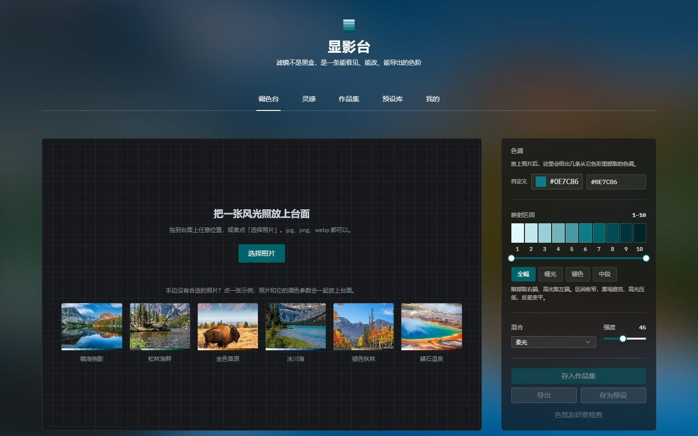

### 2. 放上照片

点一张示例，照片和它的调色参数一起放上台面；也可以放自己的照片，此时自动套用从照片里提取的第一条候选色调（可在「我的」里关闭）。背景随即退成中性深色，页头收成一行。

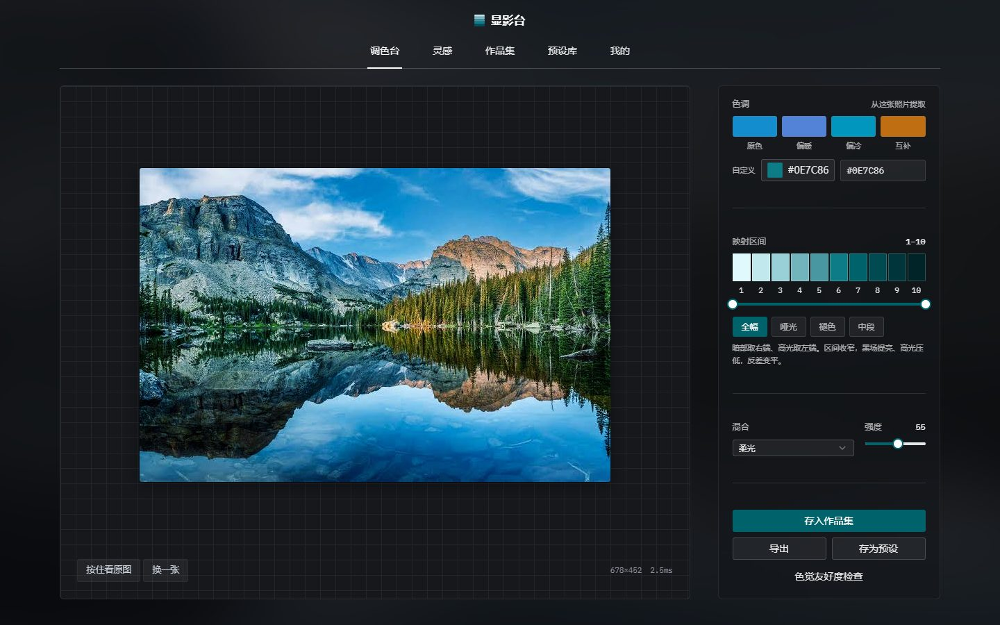

### 3. 调色

| 参数 | 作用 |
|---|---|
| 色调 | 四条候选色调，或自定义任意主色；切换时照片与界面主题色一起变 |
| 映射区间 | 取色阶的哪一段做映射。预设：全幅 1–10、哑光 3–9、褪色 4–8、中段 4–7。区间收窄，黑场提亮、高光压低，反差变平；区间外的色阶在刻度尺上压暗 |
| 混合 | 正常、柔光、叠加、明度 |
| 强度 | 0–100，映射结果混回原图的比例 |
| 按住看原图 | 按住按钮（或键盘空格 / 回车）临时看未调色的原图，松开恢复 |

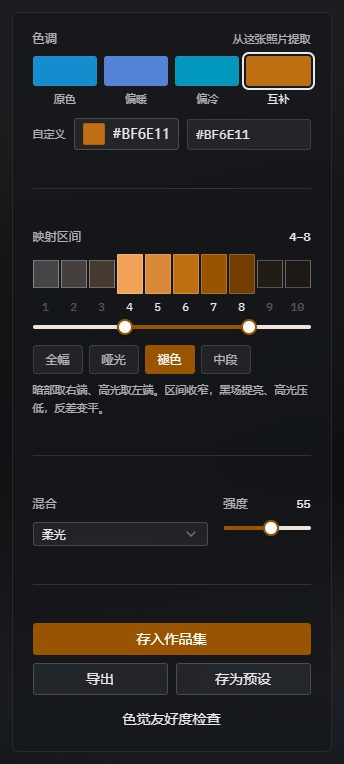

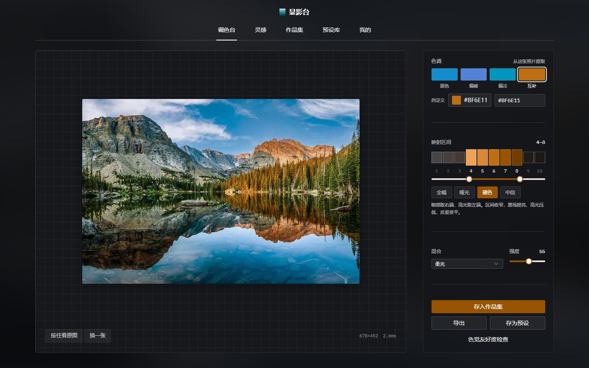

### 4. 色觉友好度检查

风光照常靠红绿对比撑画面，而约 8% 的男性有红绿色觉障碍。抽屉里并排展示当前调色结果在正常视觉与四种色觉障碍下的样子。

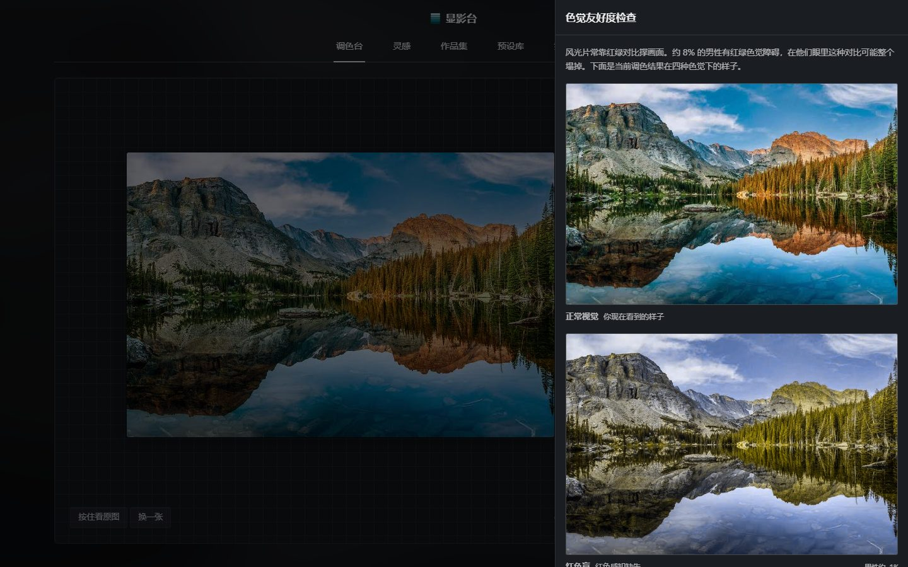

### 5. 导出

- **照片**：按原图尺寸重新渲染后导出，不是放大预览图（超大原图按比例缩到 2400 万像素以内，避免浏览器崩溃）。
- **Design Token**：当前色阶导出为 CSS 变量或 JSON，共 24 项，可以复制或下载，直接用到其他 TDesign 项目里。

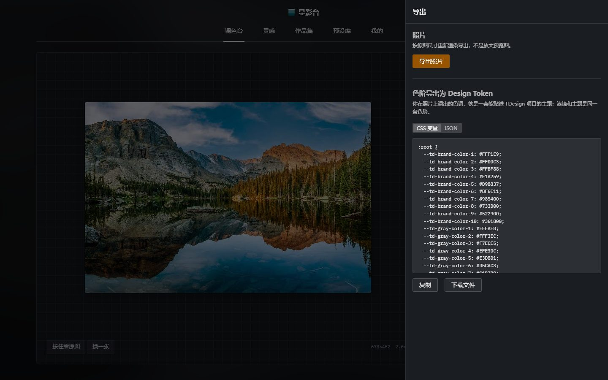

### 6. 保存与复用

- **作品集**：「存入作品集」连同全套参数存下缩略图，点开即把参数还原到调色台。
- **预设库**：「存为预设」只记色调、混合模式与强度，换一张照片也能复用；可以搜索、重命名、删除。
- **灵感**：六个调色范例，一键把参数带回调色台。
- **我的**：昵称、头像、载入照片后是否自动套用候选色调。

面板状态记在网址里（`#gallery`、`#library`……），可以直接分享链接、用浏览器后退，刷新后仍停在原面板。

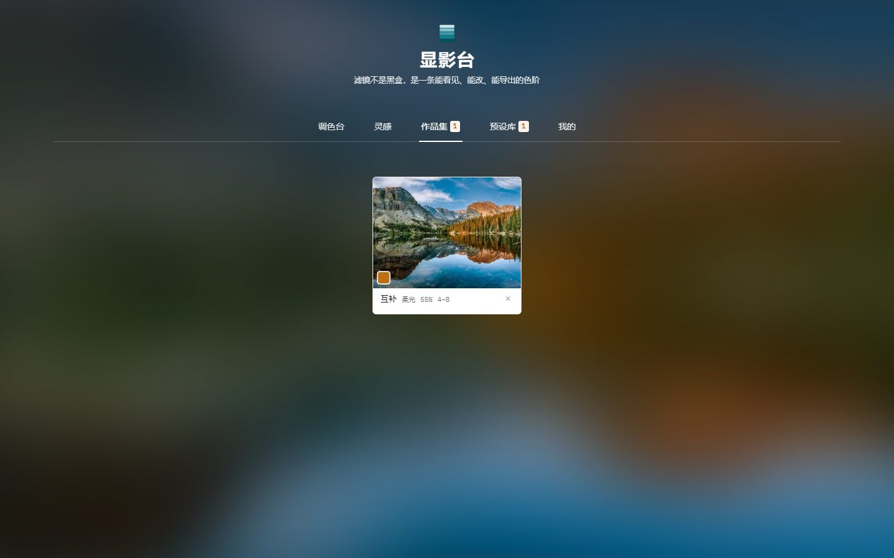

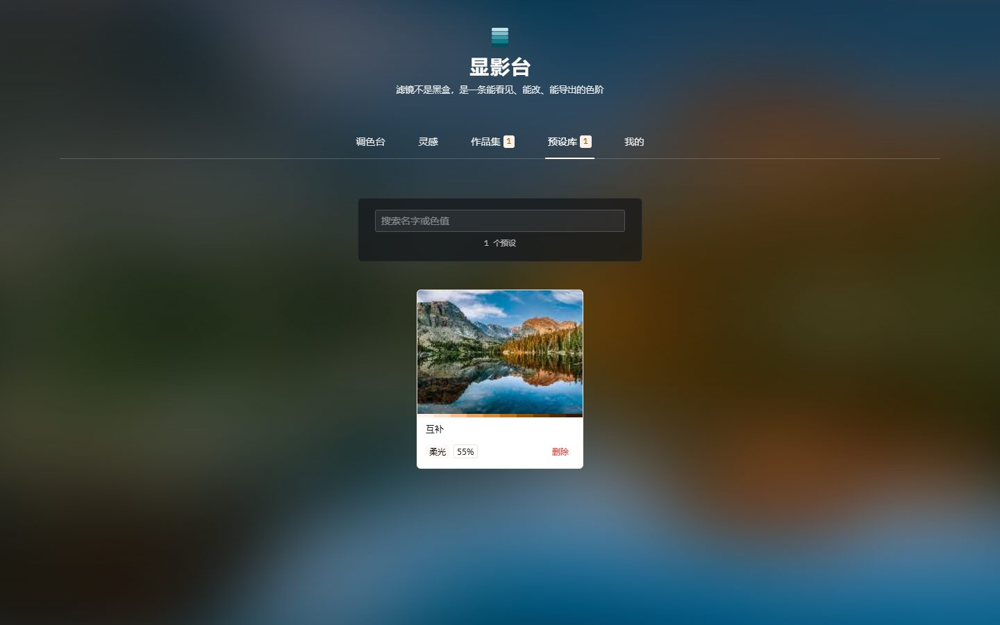

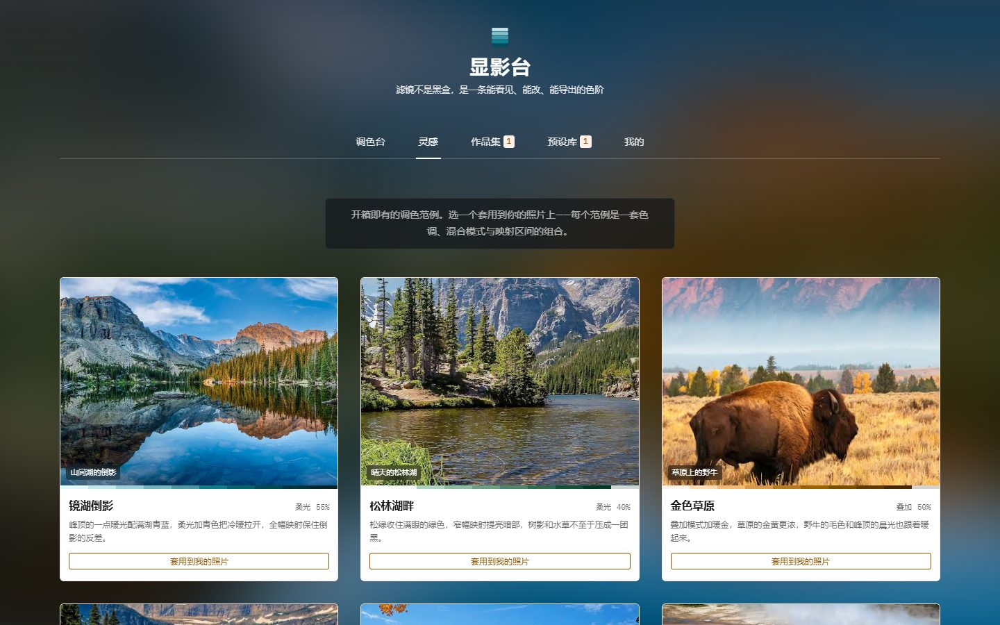

### 附：Task 01 色阶发生器

输入任意主色，生成 10 阶品牌色阶与 14 阶中性色阶，浅色、深色各一套，可在四种色觉障碍下预览，点击任一色块复制色值，并导出为 TDesign Design Token。以 TDesign 官方四套色阶的主色为输入，生成结果与官方色阶的平均色差 ΔEab 为 1.93。设计取舍见 [task01-palette/docs/design.md](task01-palette/docs/design.md)。

在线演示：https://liamfan16-mikasa.github.io/Tdesign-LiamFan/task01-palette/

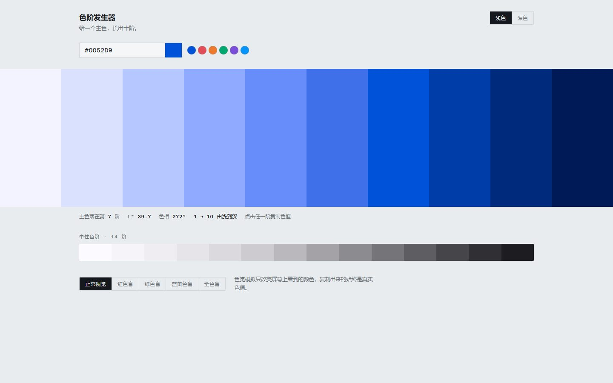

## 四、AI 的具体产出

![CodeBuddy 的产出]
Task 01 色阶发生器（在 8 月 24 日首版色阶生成器的基础上）
- 新增 Design Token 导出（CSS 变量 / JSON，共 24 项），同步更新色阶、文档与测试
- 让测试在 Windows / Node 20 上可以运行
- 页面内嵌图标，消除线上控制台的 favicon 404

Task 02 显影台
- 应用主体：
  - 渐变映射渲染管线：256 项查找表、四种混合模式、定点插值、预览长边限制在 1280 以保证流畅
  - 从照片提取四条候选色调，并支持自定义主色
  - 主题色切换：用 Task 01 生成的色阶替换 TDesign 的色彩 Design Token
  - 映射区间、混合模式、强度调节，按住看原图
  - 色觉友好度检查
  - 原图尺寸导出与 Design Token 导出
  - 灵感、作品集（IndexedDB）、预设库（localStorage）、个人中心
  - 面板状态记在网址里，支持键盘操作与读屏
- 界面与视觉：
  - 空台面改为示例印样，点一张示例即可连同参数上台
  - 电脑端中轴对称版面
  - 整页流动色彩背景，跟随正在调色的照片；调色时背景退为中性、页头收成一行
  - 暗房深色面板与材质规则：装照片的是白色卡片，操作类面板、抽屉、弹窗、提示条为深色
  - 灵感库换上真实照片并重写文案，中文标点统一
- 接入 Miora 的视觉资产：裁掉留白、统一插图线宽、压缩文件体积，用在浏览器图标、页头标记和两处空状态
- 修复：快速连换照片会显示错图；深色面板上选中的色调看不清；多处文字对比度不足

质量与交付
- 测试与验收脚本：预设逻辑 16 项、端到端流程 24 项、生产构建样式检查 6 项，每次上线前后都对照生产构建和线上地址验收
- 多轮代码审查与视觉审查，并据此修复
- 文档：仓库 README、全流程产品说明（含线上截图）
- 部署到 GitHub Pages

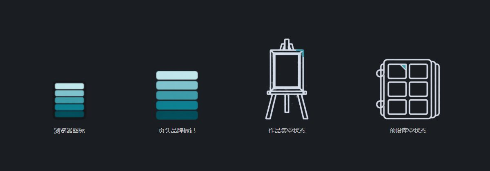

| 资产 | 用在哪 | 文件 |
|---|---|---|
| 品牌 Logo「阶梯楔」：五条由浅到深的色条，对应「色阶」这个产品核心 | 浏览器标签图标；页头站名旁的品牌标记（只取色条，不带深色底块） | `task02-develop/public/favicon.png`、`task02-develop/src/assets/brand/mark.png` |
| 作品集空状态插图：画架上的空画框 | 作品集还没有作品时 | `task02-develop/src/assets/brand/empty-gallery.png` |
| 预设库空状态插图：空着的色卡夹 | 预设库为空、或搜索没有匹配时 | `task02-develop/src/assets/brand/empty-presets.png` |

- 视觉约束：配色限定在产品主色的五阶青色与暗房台面色；线条插画只用一种浅灰线色加一处青色点缀，保证放在深色玻璃面板上清楚、和整体风格不跑偏。
- 迭代：作品集插图第一版画框同时挂在钉子上又立在画架上，改为只保留画架，并把点缀加粗成画框一角的折线。
- 接入处理：裁掉透明留白；统一两张插图在屏幕上的线宽（都约 3px）；原图每张 600–740 KB，压缩后分别为 5.9 KB、8 KB、48 KB、55 KB。

## 五、工程实现与验证

- **渲染**：256 项查找表做渐变映射，混合函数预先烤成查表，插值用定点数；预览长边限制在 1280，四种混合模式单帧都在 13ms 以内，拖动滑块不卡。导出时用原图重新渲染。
- **数据只留在本机**：没有后端，照片不上传。预设与设置存 localStorage，作品集存 IndexedDB。
- **可访问性**：纯键盘可完成上传、调色、按住看原图；画布有随参数更新的读屏描述；文字对比度不低于 4.5:1；系统开启「减少动态效果」时背景停止流动。
- **验证**：Task 01 算法测试 293 项断言；Task 02 预设库逻辑 16 项断言、端到端流程 24 项、生产构建样式检查 6 项。每次上线前后都对着生产构建和线上地址跑同一套检查。
